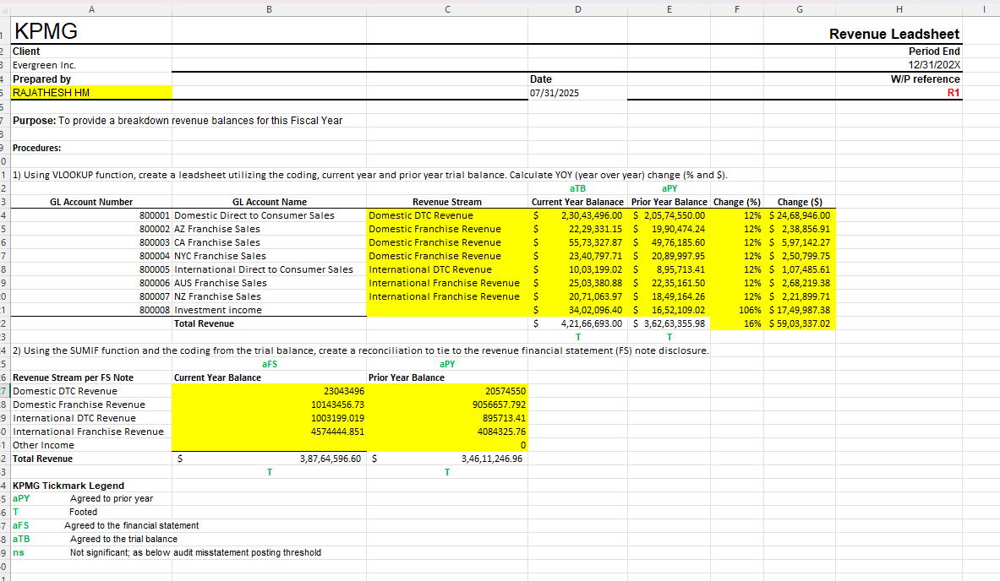

# KPMG Audit Task1 – Revenue Leadsheet Simulation (Excel Project)

This project simulates a real-world audit leadsheet preparation task based on a KPMG virtual internship case. The objective is to validate revenue balances using trial balances and chart of accounts, then build a professional audit-ready leadsheet in Excel.

---

## 🧾 Objective
To prepare a **Revenue Lead Schedule** for Evergreen Inc., a retail client, using:
- Year-End and Prior-Year Trial Balances
- COA to Revenue Stream mapping
- Excel formulas for validation, change analysis, and reconciliation

---

## 📊 Key Skills Demonstrated

| Area                    | Skills Used                                      |
|-------------------------|--------------------------------------------------|
| **Excel Functions**     | `VLOOKUP`, `SUMIF`, `% Change`, `$ Change`, `IFERROR` |
| **Audit Formatting**    | Tickmarks (`aTB`, `aPY`, `T`), reconciliation, professional layout |
| **Accounting Logic**    | COA mapping, financial statement tie-out         |
| **Documentation**       | Clear headers, client info, WP references        |

---

## 📁 File Contents

- `Evergreen_Audit_Leadsheet_Task_Completed.xlsx`: Full Excel workbook with completed leadsheet and source data
- `leadsheet-screenshot.png`: Visual snapshot of completed work for recruiters or reviewers

---

## 🖼️ Screenshot

---

## ✅ Outcome

This project demonstrates my ability to:
- Work with audit source files (trial balances, COAs)
- Build audit evidence documents independently
- Reconcile financial data professionally
- Prepare client-ready Excel deliverables

---

## 🏷️ Tags

`#Excel` `#Audit` `#KPMG` `#FinancialAnalysis` `#RevenueLeadsheet` `#Accounting` `#InternshipSimulation`

---

## 🔗 Inspired by

This project was inspired by the KPMG Virtual Internship program on Forage, and aligns with real-world deliverables expected from audit associates and analysts.

KPMG Audit Task 3 – Revenue Vouching Leadsheet (Excel Project)
This project simulates a real-world audit vouching task based on the KPMG Virtual Internship Program. The objective is to match invoice samples from a client’s subledger to supporting evidence and document the accuracy of revenue recognition in a professional audit leadsheet.

🧾 Objective
To prepare a Revenue Vouching Leadsheet for Evergreen Inc. by:

Matching 5 sample invoices from the subledger with actual invoice documents

Recording findings in an Excel leadsheet

Ensuring there are no discrepancies in amount, date, or customer name

📊 Key Skills Demonstrated
Area	Skills Used
Excel Functions	=Difference, data comparison, formatting
Audit Techniques	Vouching, matching, tick-marking
Documentation	Clear audit notes, findings summary
Attention to Detail	Invoice traceability, accuracy checks

📁 File Contents
RAJATHESH_HM_Task3_Revenue_Vouching_Workpaper.xlsx: Completed Excel leadsheet with invoice matching and findings

revenue-leadsheet.png: Screenshot of the completed leadsheet

Evergreen Invoices.pdf: Source document containing all 5 invoices used for matching

🖼️ Screenshot

✅ Outcome
This task helped demonstrate my ability to:

Match subledger records to invoice documents

Identify discrepancies in audit data (if any)

Prepare audit documentation with professional formatting

Ensure audit assertions like existence and accuracy are satisfied

🏷️ Tags
#Excel #Audit #KPMG #Vouching #FinancialAudit #InternshipSimulation

🔗 Inspired by
This project was inspired by the KPMG Virtual Internship on Forage. It reflects the type of analytical documentation and professional judgment expected in audit engagements.

## 📂 Tasks Completed
### 📂 Task 1: Control Risk Matrix

[📊 Evergreen Audit Leadsheet Task – Completed.xlsx](Evergreen_Audit_Leadsheet_Task_Completed.xlsx)

This Excel leadsheet simulates how control risks are assessed and documented during audit planning.

### 📄 Task 2: Risk Control Evaluation  
[View Report → Task_2_Report.md](Task_2_Risk_Control_Evaluation/Task_2_Report.md)

