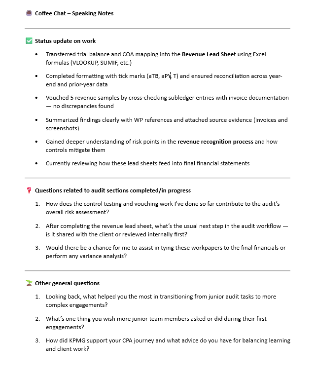

# KPMG Audit & Assurance Virtual Internship – Rajathesh H M

Completed the KPMG Virtual Internship Program via Forage, gaining hands-on experience with real-world audit tasks across 4 modules.

---

## 📁 Tasks Completed

### ✅ [Task 1 – Control Risk Matrix](./Task_1_Control_Risk_Matrix)
- Reviewed invoices and created a control risk matrix in Excel format.
- Identified potential control failures and assessed risk levels.
- **Deliverables:**
  - `Evergreen_Audit_Leadsheet_Task_Completed.xlsx`
  - `Evergreen Invoices.pdf`
  - 📷 Screenshot: `leadsheet-screenshot.png`

---

### ✅ [Task 2 – Risk Control Evaluation](./Task_2_Risk_Control_Evaluation)
- Analyzed internal controls and evaluated risk mitigation procedures.
- Identified control gaps and summarized findings in a markdown report.
- **Deliverables:**
  - `Task_2_Report.md`

---

### ✅ [Task 3 – Revenue Vouching & Leadsheet](./Task3_Revenue_Vouching_Leadsheet)
- Investigated unusual March revenue spike in Evergreen Inc.
- Performed vouching on selected samples using invoice data.
- **Deliverables:**
  - `RAJATHESH_HM_Task3_Revenue_Vouching_Workpaper.xlsx`
  - `Evergreen Invoices.pdf`
  - 📷 Screenshot: `revenue-leadsheet.png`

---

### ✅ [Task 4 – Coffee Chat Notes](./Task4_Coffee_Chat_Notes)
- Summarized key takeaways and preparation points for a virtual coffee chat session.
- Focused on networking strategy, communication approach, and personal branding.
- **Deliverables:**
  - `RAJATHESH_HM_Task4_Coffee_Chat_Speaking_Notes.docx`
  - 

---

## 🏁 Summary

- 📊 Developed leadsheets and audit documentation
- 🔍 Performed control/risk analysis and revenue testing
- 💬 Practiced professional communication for audit discussions
- 📁 Project Files organized task-wise with clear deliverables and screenshots

> ✅ **Project documented on GitHub as proof of practical audit knowledge and job-readiness.**

