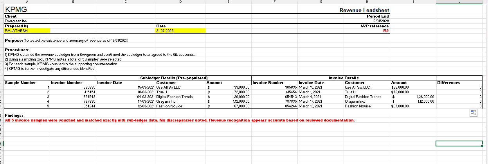

# KPMG Audit Task1 – Revenue Leadsheet Simulation (Excel Project)

This project simulates a real-world audit leadsheet preparation task based on a KPMG virtual internship case. The objective is to validate revenue balances using trial balances and chart of accounts, then build a professional audit-ready leadsheet in Excel.

---

## 🧾 Objective
To prepare a **Revenue Lead Schedule** for Evergreen Inc., a retail client, using:
- Year-End and Prior-Year Trial Balances
- COA to Revenue Stream mapping
- Excel formulas for validation, change analysis, and reconciliation

---

## 📊 Key Skills Demonstrated

| Area                    | Skills Used                                      |
|-------------------------|--------------------------------------------------|
| **Excel Functions**     | `VLOOKUP`, `SUMIF`, `% Change`, `$ Change`, `IFERROR` |
| **Audit Formatting**    | Tickmarks (`aTB`, `aPY`, `T`), reconciliation, professional layout |
| **Accounting Logic**    | COA mapping, financial statement tie-out         |
| **Documentation**       | Clear headers, client info, WP references        |

---

## 📁 File Contents

- `Evergreen_Audit_Leadsheet_Task_Completed.xlsx`: Full Excel workbook with completed leadsheet and source data
- `leadsheet-screenshot.png`: Visual snapshot of completed work for recruiters or reviewers

---

## 🖼️ Screenshot

---

## ✅ Outcome

This project demonstrates my ability to:
- Work with audit source files (trial balances, COAs)
- Build audit evidence documents independently
- Reconcile financial data professionally
- Prepare client-ready Excel deliverables

---

## 🏷️ Tags

`#Excel` `#Audit` `#KPMG` `#FinancialAnalysis` `#RevenueLeadsheet` `#Accounting` `#InternshipSimulation`

---

## 🔗 Inspired by

This project was inspired by the KPMG Virtual Internship program on Forage, and aligns with real-world deliverables expected from audit associates and analysts.

# KPMG Audit Task 3 – Revenue Vouching Leadsheet (Excel Project)

This project simulates a real-world audit vouching task from the KPMG Virtual Internship. The goal was to verify the existence and accuracy of revenue samples using subledger and invoice documents.

---

## 🧾 Objective

To complete a **Revenue Vouching Leadsheet** by:
- Sampling invoice records from Evergreen Inc.
- Matching subledger data to supporting invoice documentation
- Identifying and reporting any discrepancies

---

## 📊 Key Skills Demonstrated

| Area                    | Skills Used                                      |
|-------------------------|--------------------------------------------------|
| **Excel Functions**     | Manual validation, formula matching, variance detection |
| **Audit Evidence**      | Sample testing, invoice vouching, findings reporting |
| **Audit Formatting**    | Tickmarks, working paper structure, WP references |
| **Documentation**       | Findings summary, client info, date labeling     |

---

## 📁 File Contents

- `RAJATHESH_HM_Task3_Revenue_Vouching_Workpaper.xlsx` – Completed Excel leadsheet
- `Evergreen Invoices.pdf` – Source invoice samples
- `revenue-leadsheet.png` – Screenshot of final leadsheet work

---

## 🖼️ Screenshot

---

## ✅ Outcome

This task reflects my ability to:
- Perform audit sampling and vouching procedures
- Cross-verify subledger entries with invoice evidence
- Maintain audit documentation standards
- Present clean and audit-ready Excel files

---

## 🏷️ Tags

`#AuditSimulation` `#Excel` `#KPMG` `#RevenueVouching` `#AccountingInternship` `#FinancialAudit`

---

## 🔗 Inspired by

This project was built as part of the KPMG Virtual Internship on Forage to demonstrate audit-readiness, documentation skills, and accounting diligence expected in real-world engagements.

## 📂 Tasks Completed
### 📂 Task 1: Control Risk Matrix

[📊 Evergreen Audit Leadsheet Task – Completed.xlsx](Evergreen_Audit_Leadsheet_Task_Completed.xlsx)

This Excel leadsheet simulates how control risks are assessed and documented during audit planning.

### 📄 Task 2: Risk Control Evaluation  
[View Report → Task_2_Report.md](Task_2_Risk_Control_Evaluation/Task_2_Report.md)

📁 Task 3: Revenue Vouching Leadsheet
📂 Open → Task 3 Workpaper
🖼️ Screenshot | 📄 View Invoices PDF

This project demonstrates how sample revenue entries were vouched against original invoices, and an audit-ready leadsheet was created for review. All 5 samples were validated, and no discrepancies were found.

