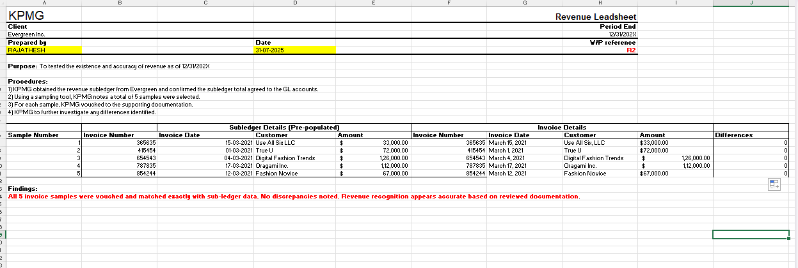

# KPMG Audit Task – Revenue Vouching Leadsheet (Excel Simulation)

This project replicates a real audit workpaper preparation task inspired by the KPMG Virtual Internship on Forage. The objective was to verify revenue recognition accuracy through invoice vouching and subledger reconciliation for Evergreen Inc.

---

## 🧾 Objective

To prepare a **Revenue Vouching Leadsheet** for Evergreen Inc. by:

- Matching subledger invoice details to actual invoices
- Investigating discrepancies, if any
- Documenting findings in a structured audit worksheet
- Ensuring revenue recognition accuracy as of 12/31/20X2

---

## 📊 Key Skills Demonstrated

| Area                    | Skills Used                                       |
|-------------------------|---------------------------------------------------|
| **Excel Functions**     | `IF`, `=`, Conditional formatting, Difference check |
| **Audit Documentation** | Workpaper-style layout, tickmarks, referencing    |
| **Analytical Thinking** | Sample testing, exception handling                |
| **Accounting**          | Revenue vouching logic, invoice review            |

---

## 📁 File Contents

- `RAJATHESH_HM_Task3_Revenue_Vouching_Workpaper.xlsx`  
  → Completed audit leadsheet for vouching results  
- `Evergreen Invoices.pdf`  
  → Source documents used for sample verification  
- `revenue-leadsheet.png`  
  → Screenshot of the final completed leadsheet for quick preview  

---

## 🖼️ Screenshot

---

## ✅ Outcome

All 5 sampled invoices were vouched and matched accurately with sub-ledger data.  
No discrepancies were noted.  
Revenue recognition appears accurate based on reviewed documentation.

---

## 🏷️ Tags

`#Excel` `#Audit` `#Vouching` `#KPMG` `#RevenueTesting` `#InternshipSimulation`

---

## 🔗 Inspired by

This project was developed as part of the **KPMG Virtual Internship (Forage)** and simulates real-world tasks expected from entry-level audit professionals.

