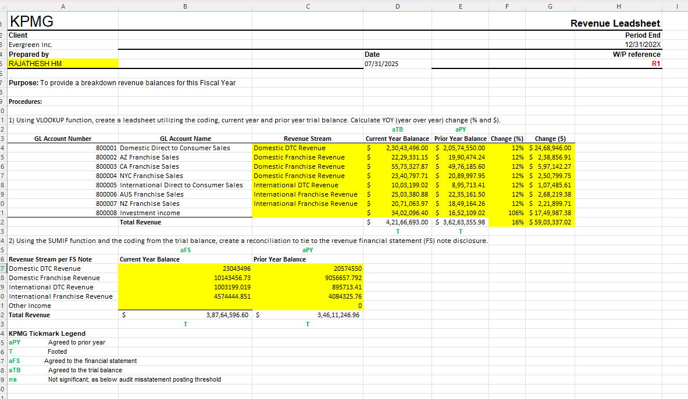

# Task 1: Control Risk Matrix

This task involves evaluating and documenting internal control risks using the provided audit leadsheet.

📁 **Files Included:**
- `Evergreen_Audit_Leadsheet_Task_Completed.xlsx`
- `leadsheet-screenshot.png`
- 

